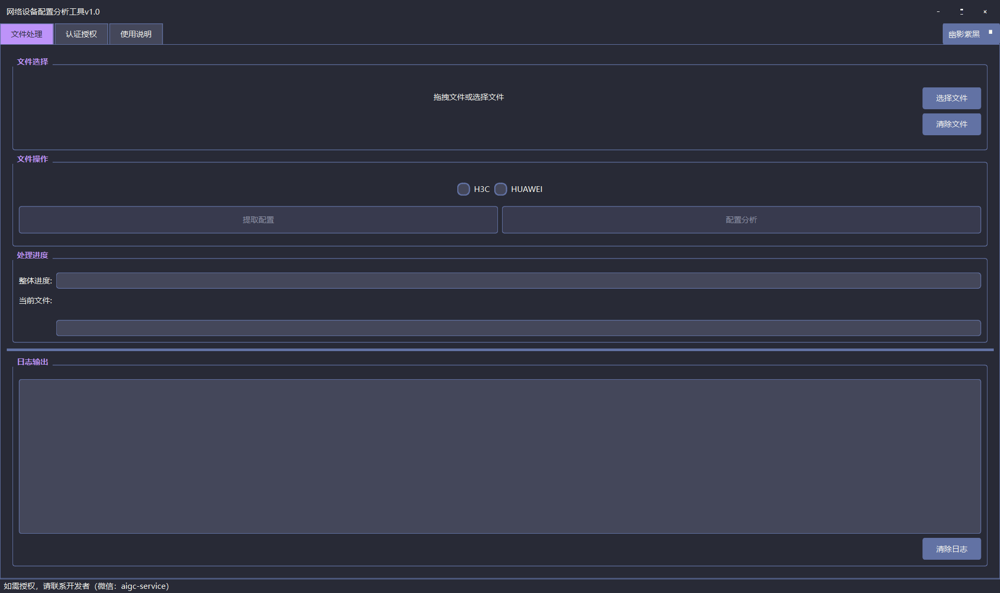
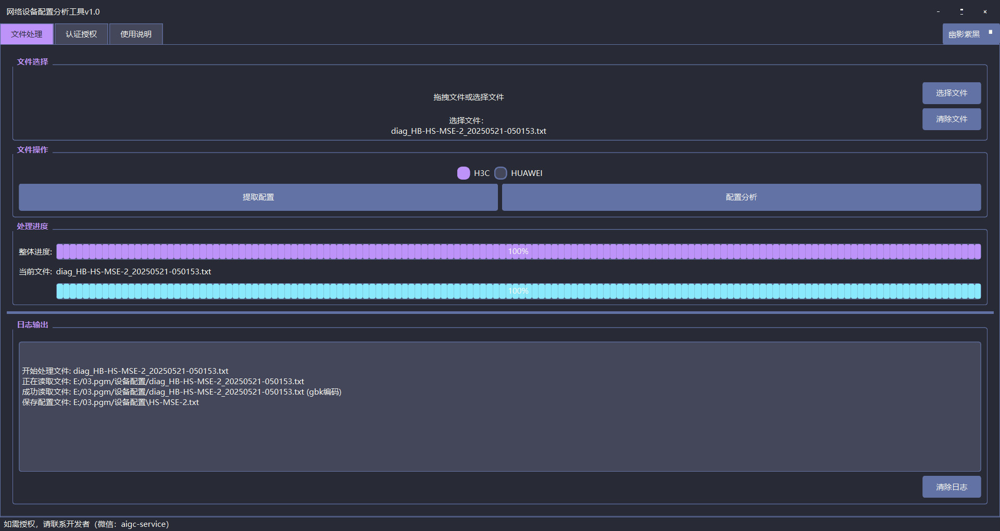
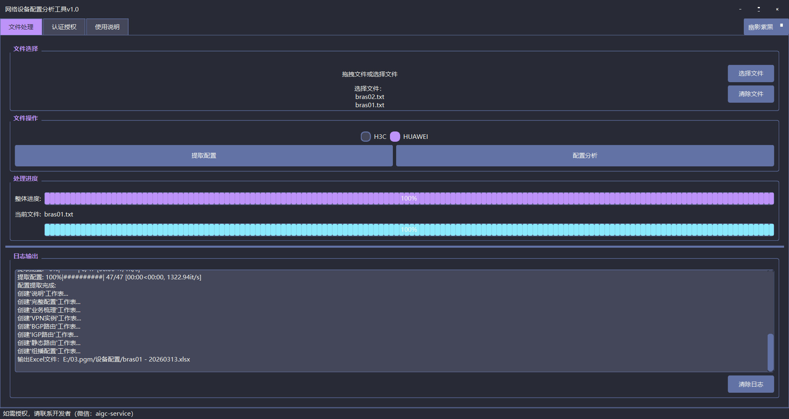
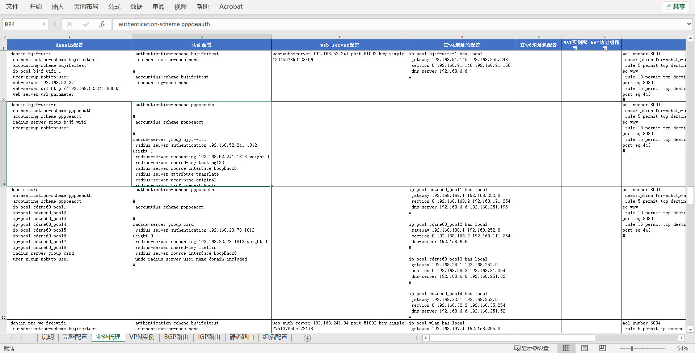
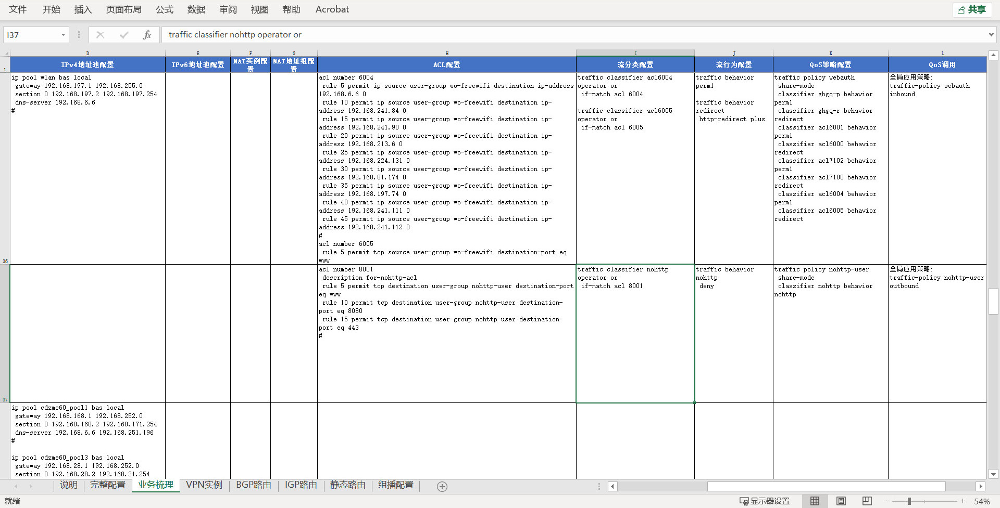
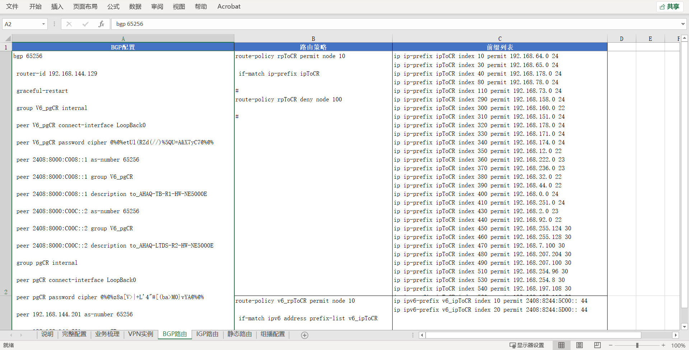

# 网络设备配置分析工具 v1.0

## 项目概述

### 项目背景

网络工程师经常需要处理大量网络设备的配置文件。传统的配置分析工作主要依赖人工完成：从诊断文件中手动提取运行配置、逐行分析配置命令、整理业务逻辑关系、制作分析报告。这种"人肉"梳理方式不仅效率低下，而且容易遗漏关键配置，特别是在处理大型网络环境时，工作量呈指数级增长。

### 项目目标

网络设备配置分析工具旨在解决网络配置分析的痛点问题，通过自动化技术实现：
- **配置自动提取**：从设备诊断文件中智能提取运行配置
- **智能分析梳理**：自动识别配置模块，建立配置间的关联关系
- **标准化报告输出**：生成结构化的Excel分析报告
- **批量处理能力**：支持多台设备配置的批量处理

### 项目意义

1. **提升工作效率**：将原本需要数时/天的配置分析工作缩短至秒级
2. **降低人为错误**：自动化处理避免人工疏漏，提高分析准确性
3. **标准化输出**：统一的报告格式便于团队协作和管理决策
4. **知识沉淀**：结构化的配置分析有助于网络知识的积累和传承

---

## 核心功能模块

### 1. 配置提取模块

**功能描述**：从网络设备诊断文件中自动提取运行配置信息。

**技术实现特点**：
- 支持多编码格式自动识别（UTF-8、GBK、Latin-1）
- 使用正则表达式精准匹配运行配置块
- 自动提取设备名称（sysname）作为文件名

**支持的文件格式**：`.txt`、`.cfg`、`.log`

**输出结果**：以设备名称命名的配置文件（`{sysname}.txt`）

### 2. 配置分析模块

#### 2.1 H3C配置分析

**支持分析的配置类型（26类）**：

| 配置类别 | 具体配置项 |
|---------|-----------|
| 认证授权 | domain配置、radius配置、tacacs配置、portal配置 |
| 用户接入 | IPoE静态会话 |
| 地址管理 | ipv4_dhcp地址组配置、ipv4_dhcp地址池配置、ipv6_dhcp地址池配置、ipv6_dhcp前缀池配置 |
| NAT配置 | nat实例配置、cgn备份组配置、nat地址组配置 |
| 接口配置 | 接口配置 |
| 访问控制 | acl配置 |
| QoS配置 | 流分类配置、流行为配置、qos策略配置、qos应用配置 |
| 路由配置 | bgp配置、igp配置（OSPF/ISIS）、静态路由、路由策略、前缀列表 |
| VPN配置 | VPN配置、l2vpn配置 |
| 组播配置 | pim配置、组播配置、组播acl、组播接口 |

#### 2.2 华为配置分析

**支持分析的配置类型（40+类）**：

| 配置类别 | 具体配置项 |
|---------|-----------|
| 认证授权 | domain配置、认证方案配置、计费方案配置、RADIUS方案配置、webserver配置、HWTACACS配置、Portal配置 |
| 用户接入 | PPPoE模板配置 |
| 地址管理 | IP地址池配置、DHCP服务器组配置、DHCP中继配置、IPv6地址池配置 |
| NAT配置 | NAT实例配置、NAT地址组配置、NAT ALG配置 |
| 接口配置 | 接口配置 |
| 访问控制 | ACL配置 |
| QoS配置 | 流分类配置、流行为配置、CBQ配置、QoS策略配置、QoS应用配置 |
| QoS配置 | 流分类配置、流行为配置、CBQ配置、QoS策略配置、Qos |
| 路由配置 | BGP配置、OSPF配置、ISIS配置、静态路由、路由策略、前缀列表 |
| VPN配置 | VPN实例配置、L2VPN配置 |
| 组播配置 | PIM配置、IGMP配置、组播配置、组播acl、组播接口 |

**技术实现特点**：
- 基于正则表达式模式匹配实现配置识别
- 智能建立配置间的关联关系（如domain与radius、地址池的关联）
- 支持嵌套配置的深度解析
- 生成多工作表Excel报告，包含完整配置、业务梳理、路由梳理、接口梳理等

### 3. 用户界面模块

**功能特性**：
- **现代化UI设计**：采用PyQt6构建的专业图形界面
- **自定义标题栏**：无边框窗口设计，支持拖拽移动和窗口控制
- **文件拖放支持**：支持文件直接拖拽到程序界面
- **实时进度显示**：双进度条设计（整体进度+当前文件进度）
- **日志实时输出**：处理过程实时显示在日志区域
- **多主题切换**：支持三种暗色主题（幽影紫黑、极简素黑、柔雾摩卡）

---

## 应用场景

### 适用行业

1. **电信运营商**：核心网、承载网、接入网设备配置管理
2. **企业IT部门**：企业园区网、数据中心网络运维
3. **系统集成商**：网络项目实施、配置迁移、验收测试
4. **网络运维服务商**：外包运维、设备巡检、故障排查
5. **教育机构**：网络技术教学、实验环境配置分析

### 典型使用场景

#### 场景一：设备巡检报告生成

**背景**：运营商要求定期提交网络设备配置巡检报告

**传统方式**：
- 登录每台设备导出配置
- 人工分析配置内容
- 手动整理成表格
- 耗时：每台设备2-4小时

**使用本工具**：
- 批量导入设备诊断文件
- 一键生成分析报告
- 直接输出标准化Excel
- 耗时：每台设备2-3分钟

#### 场景二：网络故障快速定位

**背景**：网络出现故障，需要快速分析设备配置找出问题

**传统方式**：
- 在几千行配置中搜索相关配置
- 人工判断配置关系
- 容易遗漏关键信息

**使用本工具**：
- 自动提取所有相关配置
- 按业务逻辑分类整理
- 快速定位问题配置

#### 场景三：配置迁移前的业务梳理

**背景**：网络升级改造，需要梳理现有业务配置

**传统方式**：
- 人工阅读配置文件
- 手动记录业务关系
- 整理成文档

**使用本工具**：
- 自动分析domain、radius、地址池等关联关系
- 生成业务梳理报告
- 清晰展示业务逻辑

#### 场景四：新员工培训学习

**背景**：新员工需要快速了解网络配置结构

**使用本工具**：
- 通过结构化报告学习配置组织方式
- 直观了解配置间的关联关系
- 加速网络知识掌握

### 目标用户群体

| 用户类型 | 主要需求 | 使用频率 |
|---------|---------|---------|
| 网络运维工程师 | 日常巡检、故障排查 | 每日/每周 |
| 网络架构师 | 网络规划、配置审核 | 每周/每月 |
| 系统集成工程师 | 项目实施、配置迁移 | 项目期间 |
| 网络管理员 | 设备管理、报告生成 | 每周 |
| 技术支持工程师 | 问题分析、远程支持 | 按需使用 |

---

## 致谢

感谢所有为这个项目提供建议、测试和反馈的用户。

---

*文档版本：v1.0*  
*最后更新：2024年*
